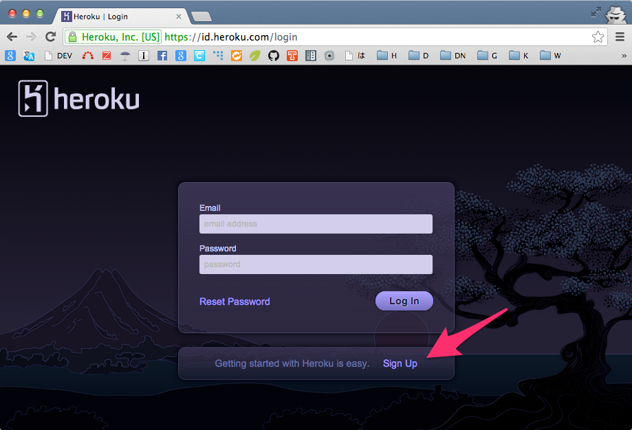
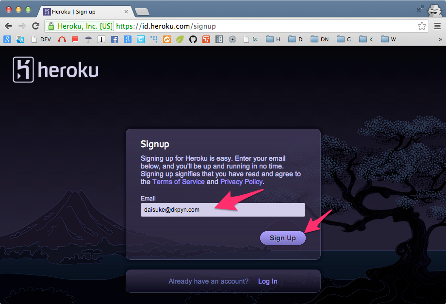
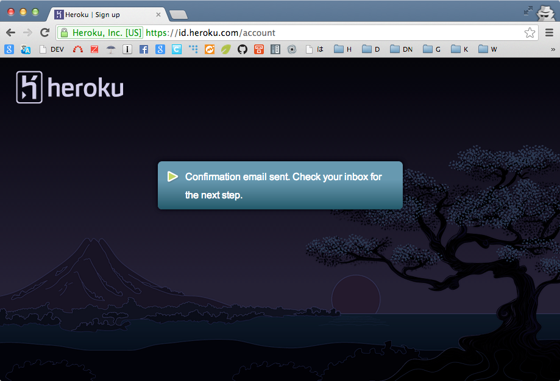
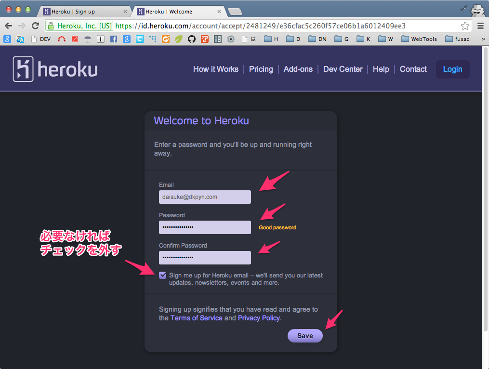
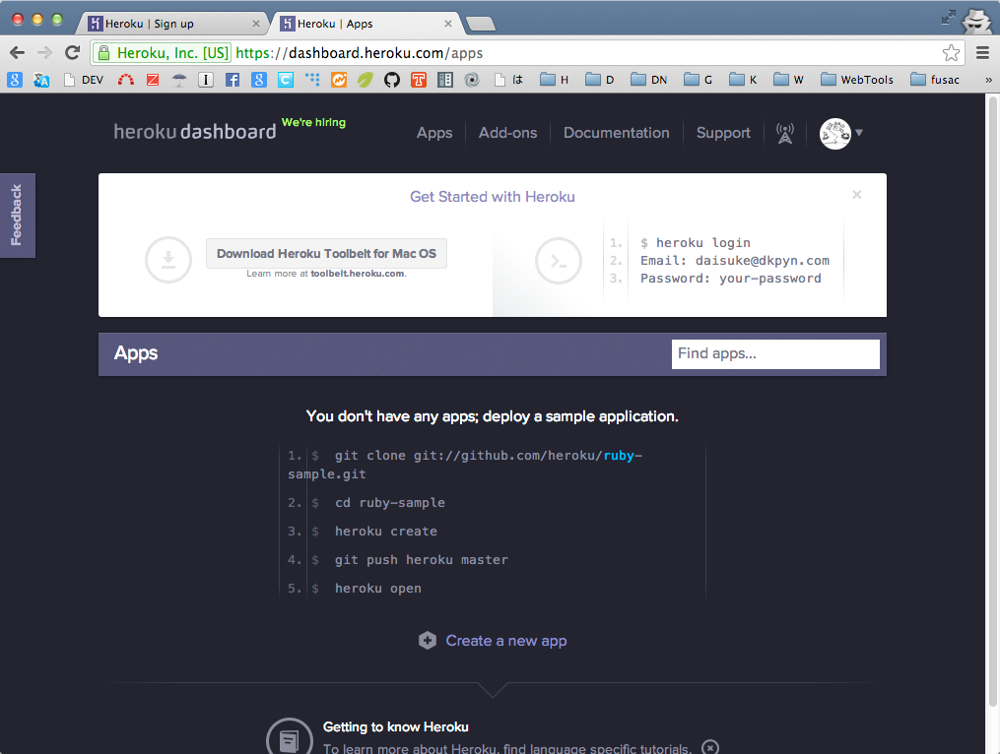

===================
5. アプリを公開する  
===================
作成したウェブアプリケーションを世の中の人に使ってもらえるようにします。

Flaskをデプロイする方法
=======================

:参考: `Deployment Options — Flask 0.10.1 documentation <http://flask.pocoo.org/docs/deploying/>`_

色々あるけど、以下の３つがおすすめ。

* apache の mod_wsgi
* uWSGI + nginx リバースプロキシ
* PaaS: heroku, dotCloud

PaaS: heroku
=============
今回はherokuにデプロイしてみます。

1. アカウントを作成
--------------------

2. ツールをインストール
------------------------
次のURLから各自のOSに合わせたToolbeltをダウンロードしてインストールします。

* `Heroku Toolbelt <https://toolbelt.heroku.com/>`_

インストールが完了したら、terminalからheroku login
を実行してherokuにログインできることを確認します。

    $ heroku login
    Enter your Heroku credentials.
    Email: daisuke@dkpyn.com
    Password (typing will be hidden):
    Found existing public key: /Users/daisuke/.ssh/id_rsa.pub
    Uploading SSH public key /Users/daisuke/.ssh/id_rsa.pub... done
    Authentication successful.

3. heroku用にファイルを変更
----------------------------
::

    pip install gunicorn

requirements.txtにgunicornを追加

.. literalinclude:: ../samples/05/requirements.txt

Procfileを追加する。

.. literalinclude:: ../samples/05/Procfile

foremanで起動のテスト::

    $ foreman start
    01:19:17 web.1  | started with pid 2062
    01:19:17 web.1  | 2013-11-04 01:19:17 [2062] [INFO] Starting gunicorn 18.0
    01:19:17 web.1  | 2013-11-04 01:19:17 [2062] [INFO] Listening at: http://0.0.0.0:5000 (2062)
    01:19:17 web.1  | 2013-11-04 01:19:17 [2062] [INFO] Using worker: sync
    01:19:17 web.1  | 2013-11-04 01:19:17 [2065] [INFO] Booting worker with pid: 2065

4. gitリポジトリを作成
----------------------
作成しているflaskrをgitで管理するようにします。すでに作っていたらそのままでOK::

    cd Flaskrを作成しているディレクトリ
    echo '*.pyc' > .gitignore
    git init
    git add .
    git commit -m 'init'

4. herokuのアプリを作成
-----------------------
heroku createでアプリを作成します。::

    $ heroku create
    Creating peaceful-wildwood-3278... done, stack is cedar
    http://peaceful-wildwood-3278.herokuapp.com/ | git@heroku.com:peaceful-wildwood-3278.git
    Git remote heroku added

5. herokuにpush
---------------
::

    git push heroku master

ウェブのプロセスを０から１に設定::

    $ heroku ps:scale web=1
    Scaling web dynos... done, now running 1

プロセスの状態の確認::

    $ heroku ps
    === web (1X): `gunicorn flaskr:app`
    web.1: up 2013/11/04 01:24:53 (~ 52s ago)

7. 動作を確認
-------------
heroku createのときに表示されたURLで確認する。

* http://peaceful-wildwood-3278.herokuapp.com/

わからなければ、herokuにログインしてappsのsettingsで確認する。

